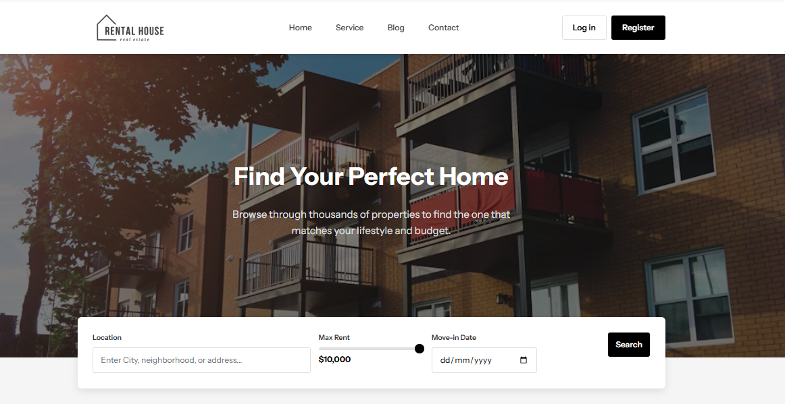
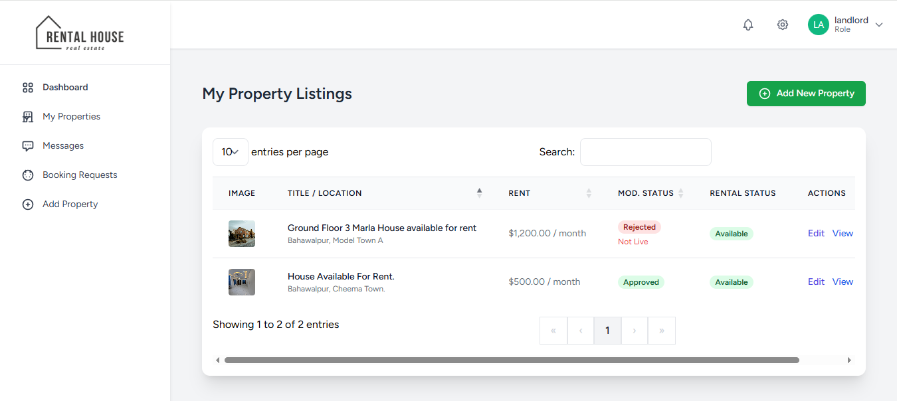
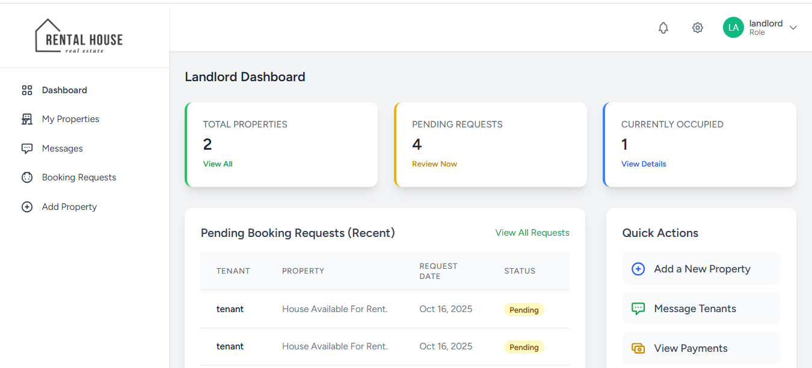

# 🏠 House Rental Web Application

A **Rental House Web App** designed to make property renting simple, transparent, and efficient.
It connects **landlords** who list their properties and **tenants** who browse, book, and rent homes — all within one seamless platform.

---

## 📘 Overview

The **House Rental Web Application** is built with **Laravel (PHP)** for the backend and **Tailwind CSS + JavaScript** for the frontend.
It follows the **MVC (Model-View-Controller)** architecture, ensuring scalability, maintainability, and performance.

### 🎯 Core Objectives
- Provide a centralized platform for listing and renting homes
- Simplify communication between landlords and tenants
- Offer secure property booking and payment management
- Reduce physical visits and manual paperwork

---

## 🖼️ Visual Showcase

Get a quick look at the application's interface:

| Home Page | Property Listing | User Dashboard |
| :---: | :---: | :---: |
|  |  |  |

***Note:*** *You must replace the placeholder image names (e.g., `homepage.png`) above with your actual file names.*

---

## ⚙️ Key Features

✅ User Authentication (Landlords, Tenants, Admin)
✅ Property Listing & Management
✅ Smart Property Search & Filtering (by city, price, or type)
✅ Booking and Application System
✅ Messaging System Between Users
✅ Integrated Payment Handling
✅ Admin Panel for Full Control
✅ Review & Rating System

---

## 🧱 Architecture Overview

**Pattern:** Model–View–Controller (MVC)

- **Model:** Handles database logic (via Laravel Eloquent ORM)
- **View:** Built using Blade templates + Tailwind CSS for responsive UI
- **Controller:** Manages requests and responses between Model and View

**Main Entities:**
- User (Admin, Tenant, Landlord)
- Property
- Booking
- Payment
- Message

---

## 💾 Database Overview

| Table | Description |
|-------|--------------|
| **Users** | Stores tenant, landlord, and admin details |
| **Properties** | Contains property listings owned by landlords |
| **Bookings** | Tracks tenant bookings and approvals |
| **Payments** | Logs all payment records |
| **Messages** | Stores user-to-user communication |

---

## 🧑‍💻 Installation & Setup

Follow these steps to run the project locally:

### 1. Clone the Repository
```bash
git clone [https://github.com/hammadriaz-dev/Rental-House-Web-App.git](https://github.com/hammadriaz-dev/Rental-House-Web-App.git)
cd Rental-House-Web-App
